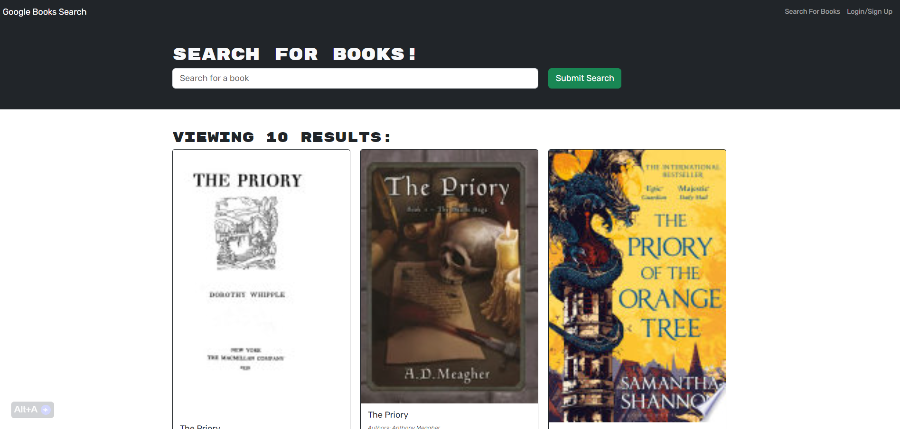

# C21-MERN-BookSearchEngine

  ## Description
  The aim of this project was to use an existing and functioning Book Search Engine and refactor it from a RESTful API to be a GraphQL API built with Apollo Server.
  The app was built using the MERN stack with a React front end, MongoDB database, and Node.js/Express.js server and API.
  
  ## Table of Contents
  * [Description](#description)
  * [Installation](#installation)
  * [Usage](#usage)
  * [Licenses](#licenses)
  * [Contributing](#how-to-contribute)
  * [Tests](#tests)
  * [Questions/Contact Info](#questionscontacts)
  * [Credits](#credits)

  ## Installation
  There is no installation required to run this app, you can simply click the link to see the deployed site. 
  If you would like to use the code locally, use the below steps...
  1. Clone the code from this repository
  2. Open the project in VS Code (or similar)
  3. Install npm dependancies
  4. Run the application from the terminal

  ## Usage
  Screenshot, GIF + deployed app link is below...
  
  
 ### Link deployed application (https://booksearchengine-21ux.onrender.com)

  ## Licenses
  This project is covered under the MIT license.
  To learn more about what this means, click the license button at the top.

  ## How to contribute
  Contact me via the details below.

  ## Tests
  N/A

  ## Questions/Contacts
  Have questions about this project?  
  GitHub: https://github.com/Petarlo 
  Email: petaswan986@gmail.com  

  ## Credits
  N/A
